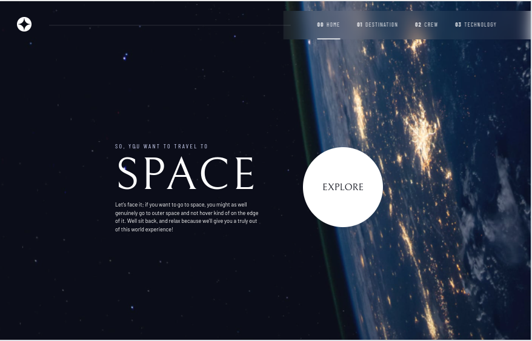

# Frontend Mentor - Space tourism website

## Welcome! 👋

This is a solution to the [Space tourism website challenge on Frontend Mentor](https://www.frontendmentor.io/challenges/space-tourism-multipage-website-gRWj1URZ3). Frontend Mentor challenges help you improve your coding skills by building realistic projects.

## Content

- [The challenge](#the-challenge)
- [Screenshot](#screenshot)
- [Links](#links)
- [My process](#my-process)
- [Built with](#built-with)
- [Author](#author)
- [Contact Us](#connect-us)

## The challenge

Users should be able to:

- View the optimal layout for each of the website's pages depending on their device's screen size
- See hover states for all interactive elements on the page
- View each page and be able to toggle between the tabs to see new information

### Screenshot

### Links

- Live Site URL: [Space Tourism](https://ibrahimbagalwa.github.io/space-tourism/)

## My process

### Built with

- Semantic HTML5 markup
- CSS custom properties
- Flexbox
- CSS Grid
- Mobile-first workflow

## Author

- Twitter - [@ibrahim_Bagalwa](https://twitter.com/ibrahim_Bagalwa)
- LinkedIn - [ibrahim-bagalwa](https://www.linkedin.com/in/IbrahimBagalwa)

## Connect Us:

   
___

